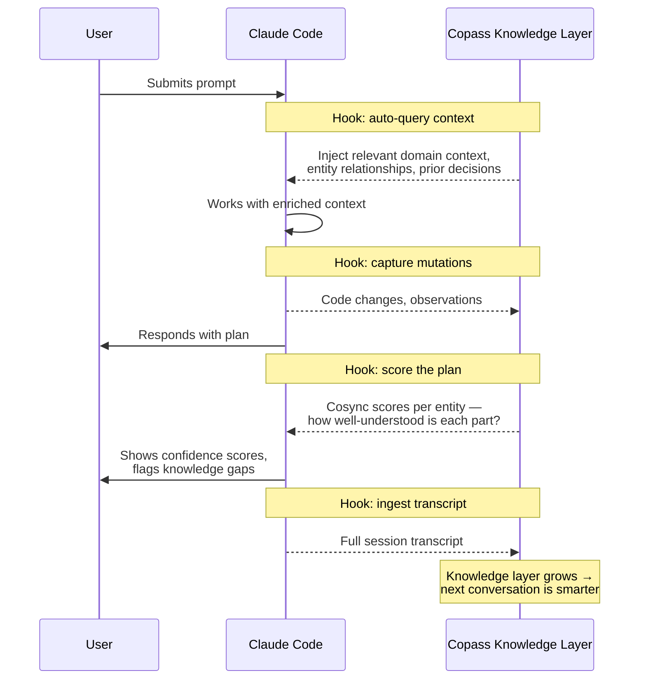

Claude Code plugin for [Olane](https://olane.com).
Other coding agent support coming soon.

## Installation

### 1. Install the CLI

```bash
brew install olane-labs/tap/olane
# or: npm install -g @olane/o-cli
```

### 2. Authenticate & Setup

```bash
olane login # sign up via this command as well
olane setup # adds the mcp via (.mcp.json) + file indexing for the current folder
```

<Accordion title="Manual MCP configuration">
If you prefer to configure the MCP server manually, add the following to your MCP config:

```json
{
  "mcpServers": {
    "copass": {
      "type": "stdio",
      "command": "olane",
      "args": ["copass", "--mcp"]
    }
  }
}
```
</Accordion>

<Tip>
Having trouble? Try re-indexing your project: `olane index --mode full`
</Tip>

## The Problem

Claude Code starts every conversation blank. It can read your code, but code doesn't capture **why** something was built a certain way, how entities in your system relate, what was decided in last week's session, or the tribal knowledge that lives in your team's heads. Without this context, Claude confidently makes changes based on incomplete understanding — and the more complex your project, the worse this gets.

## Functional Memory

Copass creates a **continuous knowledge loop** between Claude Code and a persistent ontology graph, so that every conversation starts with the context from all previous ones.



### What happens at each stage

<Steps>
  <Step title="Context injection (on every prompt)">
    Before Claude sees your message, Copass is queried for relevant context — domain knowledge, entity relationships, prior decisions — and injects it automatically. You never need to re-explain what was discussed before.
  </Step>
  <Step title="Mutation capture (on code changes)">
    Every `Edit`, `Write`, and `NotebookEdit` is captured and ingested into the knowledge graph asynchronously. Claude's work product becomes future context without anyone curating it.
  </Step>
  <Step title="Plan confidence scoring (before execution)">
    When Claude proposes a plan, Copass scores each entity involved. High scores mean Copass has strong context — proceed confidently. Low scores mean Claude is operating in a knowledge gap and should confirm with you first.
  </Step>
  <Step title="Transcript ingestion (on session end)">
    The full conversation transcript is ingested when the session ends. Decisions, rationale, and discussion all become retrievable context for future sessions.
  </Step>
</Steps>

### Cosync Scores

Cosync scores answer the question: **"How much does Copass actually know about what Claude is about to do?"**

Scores are displayed automatically in two places:

- **On plans** — Claude shows per-entity scores before executing. Entities with low scores are flagged so you can provide missing context.
- **On permission requests** — When Claude asks to run a command or edit a file, you see at a glance whether the action is in well-understood territory.

```
━━ Copass Scores ━━

  PaymentService: ████████████ 92%
  WebhookHandler: ████████░░░░ 67%
  RateLimiter:    ██░░░░░░░░░░ 15%

  Total: ████████░░░░░░░░░░░░ 58%
```

In this example, Claude knows `PaymentService` well but has almost no context for `RateLimiter` — it should ask you before making changes there.

## Tools

| Tool | Description |
|------|-------------|
| `check_project_status` | Check project indexing and authentication state |
| `ingest_code` | Ingest source code into the knowledge graph |
| `ingest_text` | Ingest text into the knowledge graph |
| `cosync_analyze` | Analyze entities with confidence scoring |
| `cosync_question` | Ask questions about the ontology |
| `search_entities` | Search for entities in the knowledge graph |
| `get_score` | Get cosync scores for entities |
| `get_task_cosync` | Get cosync context for a task |
| `get_learning_requests` | Get learning requests for low-scoring entities |
| `index_project` | Index the current project |

## Architecture

The plugin runs `olane copass --mcp` which starts a unified MCP server over stdio. All authentication and encryption is handled by the Olane CLI — no separate local/remote servers needed. Your raw text is encrypted client-side before transmission (see [Security & Indexing](/indexing) for details).

## Requirements

- [Olane CLI](https://www.npmjs.com/package/@olane/o-cli?activeTab=readme) v2.0.0+
- An Olane account (`olane login`)
