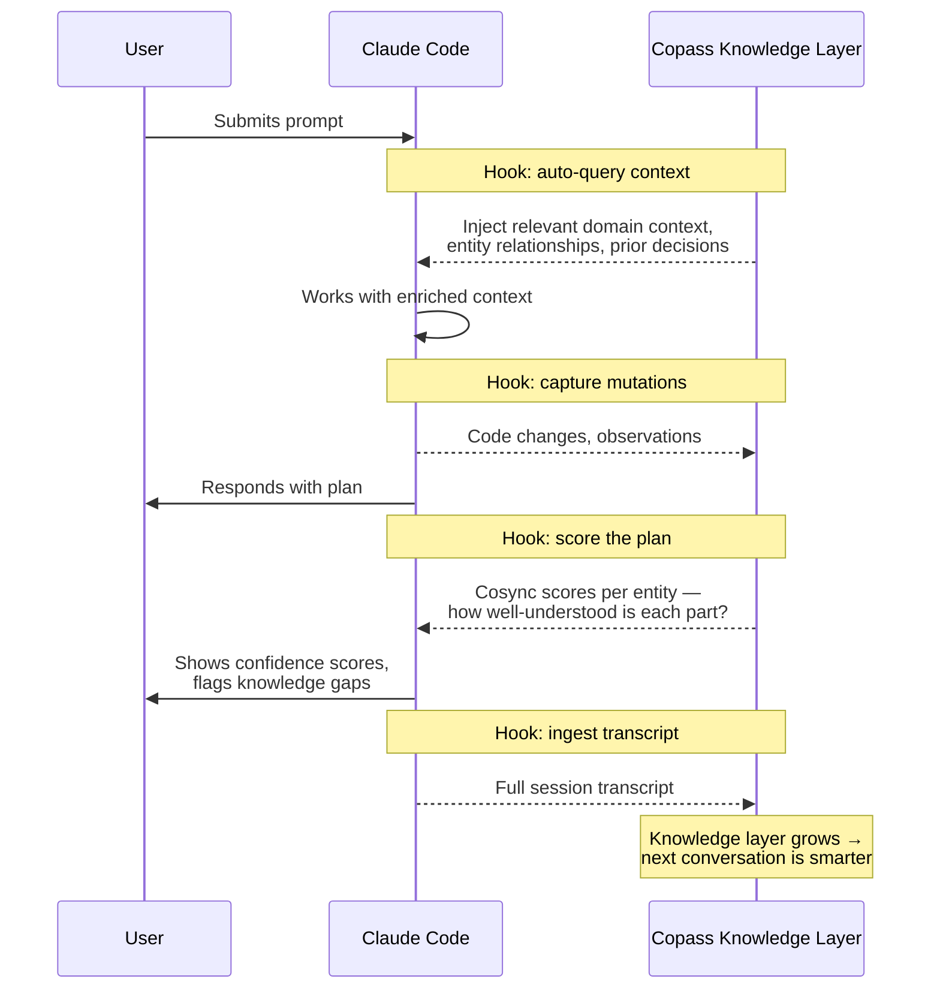

<div style={{ fontSize: '1.5rem', fontWeight: 700, marginBottom: '0.25rem' }}>Teach Claude **why**, not just **what**.</div>
<div style={{ fontSize: '0.95rem', color: '#6B7280', marginBottom: '1.5rem' }}>Claude Code plugin for [Olane](https://olane.com).</div>

<div style={{ maxWidth: '100%', margin: '0 0 1.5rem 0', padding: '1.25rem', border: '1px solid #E5E7EB', borderRadius: '12px' }}>
  <div style={{ display: 'flex', justifyContent: 'space-between', alignItems: 'baseline', marginBottom: '1rem' }}>
    <div style={{ fontSize: '0.75rem', fontWeight: 600, color: '#6B7280', textTransform: 'uppercase', letterSpacing: '0.05em' }}>LongMemEval Benchmark</div>
    <div style={{ fontSize: '0.65rem', color: '#9CA3AF' }}>GPT-4o · 500 questions</div>
  </div>
  <div style={{ display: 'flex', flexDirection: 'column', gap: '0.6rem' }}>
    <div style={{ display: 'flex', alignItems: 'center', gap: '0.75rem' }}>
      <span style={{ fontSize: '0.8rem', fontWeight: 700, width: '85px', flexShrink: 0 }}>Olane</span>
      <div style={{ flex: 1, background: '#F3F4F6', borderRadius: '6px', height: '28px', overflow: 'hidden', position: 'relative' }}>
        <div style={{ background: 'linear-gradient(90deg, #16A34A, #22C55E)', height: '100%', width: '92.2%', borderRadius: '6px', display: 'flex', alignItems: 'center', justifyContent: 'flex-end', paddingRight: '8px' }}>
          <span style={{ fontSize: '0.8rem', fontWeight: 700, color: 'white' }}>92.2%</span>
        </div>
      </div>
    </div>
    <div style={{ display: 'flex', alignItems: 'center', gap: '0.75rem' }}>
      <span style={{ fontSize: '0.8rem', color: '#6B7280', width: '85px', flexShrink: 0 }}>Mastra OM</span>
      <div style={{ flex: 1, background: '#F3F4F6', borderRadius: '6px', height: '28px', overflow: 'hidden', position: 'relative' }}>
        <div style={{ background: '#D1D5DB', height: '100%', width: '84.23%', borderRadius: '6px', display: 'flex', alignItems: 'center', justifyContent: 'flex-end', paddingRight: '8px' }}>
          <span style={{ fontSize: '0.75rem', fontWeight: 600, color: '#6B7280' }}>84.2%</span>
        </div>
      </div>
    </div>
    <div style={{ display: 'flex', alignItems: 'center', gap: '0.75rem' }}>
      <span style={{ fontSize: '0.8rem', color: '#6B7280', width: '85px', flexShrink: 0 }}>Supermemory</span>
      <div style={{ flex: 1, background: '#F3F4F6', borderRadius: '6px', height: '28px', overflow: 'hidden', position: 'relative' }}>
        <div style={{ background: '#D1D5DB', height: '100%', width: '81.6%', borderRadius: '6px', display: 'flex', alignItems: 'center', justifyContent: 'flex-end', paddingRight: '8px' }}>
          <span style={{ fontSize: '0.75rem', fontWeight: 600, color: '#6B7280' }}>81.6%</span>
        </div>
      </div>
    </div>
    <div style={{ display: 'flex', alignItems: 'center', gap: '0.75rem' }}>
      <span style={{ fontSize: '0.8rem', color: '#6B7280', width: '85px', flexShrink: 0 }}>Zep</span>
      <div style={{ flex: 1, background: '#F3F4F6', borderRadius: '6px', height: '28px', overflow: 'hidden', position: 'relative' }}>
        <div style={{ background: '#D1D5DB', height: '100%', width: '71.2%', borderRadius: '6px', display: 'flex', alignItems: 'center', justifyContent: 'flex-end', paddingRight: '8px' }}>
          <span style={{ fontSize: '0.75rem', fontWeight: 600, color: '#6B7280' }}>71.2%</span>
        </div>
      </div>
    </div>
  </div>
  <div style={{ fontSize: '0.7rem', color: '#9CA3AF', marginTop: '0.75rem' }}>[Full benchmark results →](/benchmarks)</div>
</div>

## Installation

### 1. Install the CLI

```bash
brew install olane-labs/tap/olane
# or: npm install -g @olane/o-cli
```

### 2. Authenticate & Setup

```bash
olane login    # sign up via this command as well
olane logout   # clear credentials
olane setup    # adds the mcp via (.mcp.json) + file indexing for the current folder
# or: olane setup -y  # non-interactive with recommended settings (useful for CI)
```

<Accordion title="Manual MCP configuration">
If you prefer to configure the MCP server manually, add the following to your MCP config:

```json
{
  "mcpServers": {
    "copass": {
      "type": "stdio",
      "command": "olane",
      "args": ["copass", "--mcp"]
    }
  }
}
```
</Accordion>

<Tip>
Having trouble? Try re-indexing your project: `olane index --mode full`. Additional flags: `--max-files <n>`, `--dry-run`, `--json`.
</Tip>

## The Problem

Claude Code starts every conversation blank. It can read your code, but code doesn't capture **why** something was built a certain way, how entities in your system relate, what was decided in last week's session, or the tribal knowledge that lives in your team's heads. Without this context, Claude confidently makes changes based on incomplete understanding — and the more complex your project, the worse this gets.

## Functional Memory

Copass creates a **continuous knowledge loop** between Claude Code and a persistent ontology graph, so that every conversation starts with the context from all previous ones.



### What happens at each stage

<Steps>
  <Step title="Context injection (on every prompt)">
    Before Claude sees your message, Copass is queried for relevant context — domain knowledge, entity relationships, prior decisions — and injects it automatically. You never need to re-explain what was discussed before.
  </Step>
  <Step title="Mutation capture (on code changes)">
    Every `Edit`, `Write`, and `NotebookEdit` is captured and ingested into the knowledge graph asynchronously. Claude's work product becomes future context without anyone curating it.
  </Step>
  <Step title="Plan confidence scoring (before execution)">
    When Claude proposes a plan, Copass scores each entity involved. High scores mean Copass has strong context — proceed confidently. Low scores mean Claude is operating in a knowledge gap and should confirm with you first.
  </Step>
  <Step title="Transcript ingestion (on session end)">
    The full conversation transcript is ingested when the session ends. Decisions, rationale, and discussion all become retrievable context for future sessions.
  </Step>
</Steps>

### Cosync Scores

Cosync scores answer the question: **"How much does Copass actually know about what Claude is about to do?"**

Scores are displayed automatically in two places:

- **On plans** — Claude shows per-entity scores before executing. Entities with low scores are flagged so you can provide missing context.
- **On permission requests** — When Claude asks to run a command or edit a file, you see at a glance whether the action is in well-understood territory.

```
━━ Copass Scores ━━

  PaymentService: ████████████ 92%
  WebhookHandler: ████████░░░░ 67%
  RateLimiter:    ██░░░░░░░░░░ 15%

  Total: ████████░░░░░░░░░░░░ 58%
```

In this example, Claude knows `PaymentService` well but has almost no context for `RateLimiter` — it should ask you before making changes there.

## Tools

| Tool | Description |
|------|-------------|
| `check_project_status` | Check project indexing and authentication state |
| `cosync_question` | Ask questions about the ontology |
| `cosync_analyze` | Analyze entities with confidence scoring |
| `search_entities` | Search for entities in the knowledge graph |
| `get_score` | Get cosync scores for entities |
| `get_task_cosync` | Get cosync context for a task |
| `get_learning_requests` | Get learning requests for low-scoring entities |
| `ingest_code` | Ingest source code into the knowledge graph |
| `ingest_text` | Ingest text into the knowledge graph |
| `index_project` | Index the current project |

## CLI Reference

Beyond setup and indexing, the CLI exposes several commands for interacting with the ontology graph directly.

### Search

```bash
olane search <query>        # search the ontology graph for entities, relationships, and context
```

### Copass (CLI equivalents of MCP tools)

```bash
olane copass question <question>   # ask a natural language question against the ontology
olane copass context               # get LLM-generated context summary for entities or text
olane copass score <query>         # score how well the knowledge graph understands a topic
```

### Watch

```bash
olane watch                        # start continuous incremental indexing
olane watch status                 # check watch status
olane watch install-service        # install and start as a background service
olane watch uninstall-service      # uninstall the background service
```

### API Key Management

```bash
olane api-key create [--name <name>]   # create a new API key
olane api-key list                     # list active API keys
olane api-key revoke <key-id>          # revoke an API key
```

### Configuration

```bash
olane config set <key> <value>     # set a config value
olane config get <key>             # get a config value
olane config list                  # list all config values
```

### Ingest

```bash
olane ingest code [file]           # ingest source code (or stdin with --stdin)
olane ingest text [file]           # ingest text content (or stdin with --stdin)
```

Common flags: `--additional-context <ctx>`, `--project-id <id>`, `--json`. Code-specific: `--language <lang>`, `--file-path <path>`. Text-specific: `--source-type <type>`, `--entity-hints <hints>`.

### Utilities

```bash
olane status [--json]              # check project indexing status
olane upgrade [--dry-run]          # upgrade CLI to latest version
olane transcript clean <file>      # clean Claude Code transcript JSONL into readable markdown
```

## Architecture

The plugin runs `olane copass --mcp` which starts a unified MCP server over stdio. All authentication and encryption is handled by the Olane CLI — no separate local/remote servers needed. Your raw text is encrypted client-side before transmission (see [Security & Indexing](/indexing) for details).

## Requirements

- [Olane CLI](https://www.npmjs.com/package/@olane/o-cli?activeTab=readme) v2.0.0+
- An Olane account (`olane login`)
